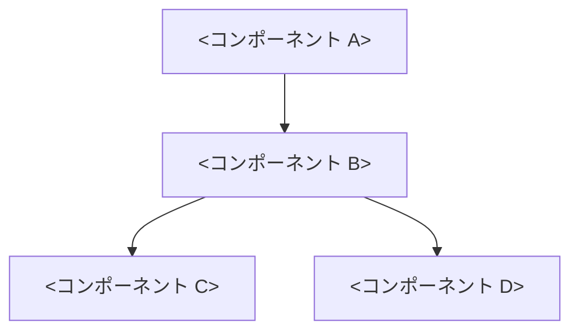

# <プロジェクト名> 設計書 v<X.Y>

## 概要

<このシステムが何を目指すのか、どんな課題を解こうとするのかを 3〜5 行で>

<最終的に目指す像を 1 行のキャッチで>

---

# 基本方針

## 1. <方針 1 のタイトル>

<方針の中身を簡潔に>

詳細は [ADR NNNN](../adr/NNNN-...md) を参照。

---

## 2. <方針 2 のタイトル>

<同上>

---

## 3. <方針 3 のタイトル>

<同上>

---

# 全体構成



---

# リポジトリ構成

```txt
<project>/
├── ...
```

---

# 権限の仕組み

<権限の仕組みが必要なら書く。なければセクションごと削る>

| 状態 | 意味 |
| --- | --- |
| allow | 自動で実行 |
| ask | 都度確認 |
| deny | 禁止 |

例:

```yaml
permissions:
  read_file: allow
  write_file: ask
  shell: ask
```

---

# CLI コマンド例

```bash
<project> <subcommand>
```

---

# 最終ゴール

> <ビジョンを 1 文で>

---

# 設計判断の記録

主な記録:

- [ADR 0001 - <タイトル>](../adr/0001-...md)
- [ADR 0002 - <タイトル>](../adr/0002-...md)

記録のやり方は [docs/adr/README.md](../adr/README.md) を参照。
