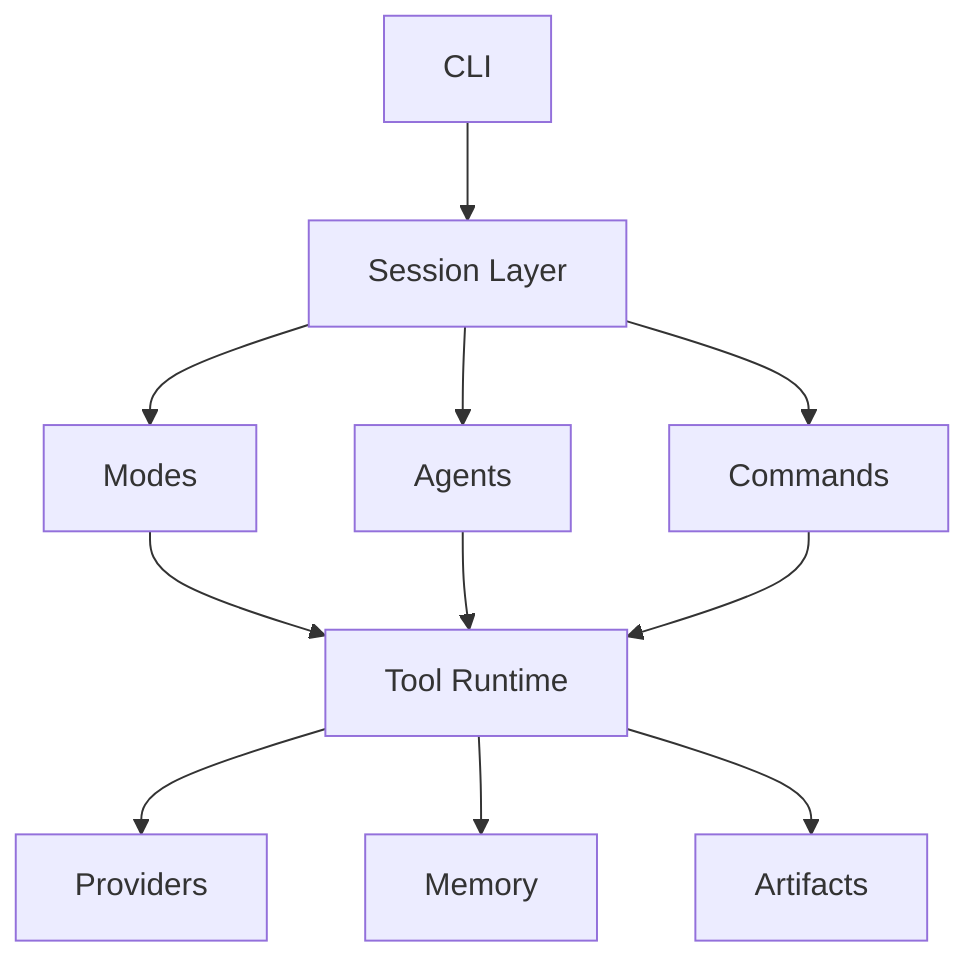

# Midna Design Document v0.1

## Overview

Midna is a local-first AI operating environment that combines:

- conversational AI
- coding agent capabilities
- multimodal generation
- extensible tools
- reusable skills
- autonomous agents

into a unified developer-focused platform.

The primary goal is to create a highly extensible AI companion similar to Claude Code, while remaining provider-agnostic and capable of running both local and remote models.

---

# Core Philosophy

## 1. Local-first

Midna は推論を**オフラインで完結**させることを基本姿勢とする:

- 手元のモデル / 手元の実行 / 手元のファイル / 手元の記憶
- LLM の呼び出しに外部 API は使わない

例外として、最新情報を取りに行くツール（Web からの取得や Web 検索）にだけ外部通信を許可する。詳細は [ADR 0002](../adr/0002-offline-first-with-browsing-exception.md) を参照。

---

## 2. Tool-driven AI

LLMs should not directly solve everything from context alone.

Midna operates through tools:

- filesystem access
- shell execution
- git operations
- image analysis
- media generation
- project inspection

The model acts as a planner and orchestrator.

---

## 3. Mode-based UX

Midna supports multiple operational modes:

- chat
- code
- image
- video
- multimodal

Modes define intent and behavior.

---

## 4. Extensibility First

Users should be able to extend Midna through:

- commands
- skills
- agents
- prompts
- tools

without modifying core source code.

---

# High-Level Architecture



---

# Repository Structure

実装は Rust の Cargo project として構成する（言語選定は [ADR 0001](../adr/0001-use-rust.md)）。

```txt
midna/
├── Cargo.toml
├── Cargo.lock
├── src/
│   ├── main.rs              # CLI entrypoint
│   ├── lib.rs               # 公開モジュールルート
│   ├── cli.rs               # 引数パース
│   ├── session.rs           # 会話履歴 + ループ
│   ├── error.rs             # MidnaError
│   ├── permissions.rs       # Permission policy
│   ├── modes/
│   │   ├── chat.rs
│   │   ├── code.rs          # (future)
│   │   ├── image.rs         # (future)
│   │   ├── video.rs         # (future)
│   │   └── multimodal.rs    # (future)
│   ├── providers/
│   │   ├── mod.rs           # Provider trait
│   │   └── ollama.rs
│   ├── agents/              # (future)
│   ├── commands/            # (future)
│   ├── skills/              # (future)
│   ├── prompts/             # (future)
│   └── tools/               # (future)
│       ├── filesystem.rs
│       ├── shell.rs
│       ├── git.rs
│       ├── vision.rs
│       ├── media.rs
│       └── network.rs
├── tests/
├── docs/
│   ├── design/
│   └── adr/
└── tmp/
```

`(future)` の付いたモジュールは v0 では未実装。実際に必要になったタイミングで追加する。

---

# Permission System

Permission levels:

| Level | Meaning               |
| ----- | --------------------- |
| allow | Execute automatically |
| ask   | Require confirmation  |
| deny  | Disallowed            |

Example:

```yaml
permissions:
  read_file: allow
  write_file: ask
  shell: ask
  delete_file: deny
  git_push: deny
```

---

# CLI Examples

```bash
midna chat
midna code
midna image
midna video

midna "fix failing tests"

midna review app/models/user.rb

midna --model llama3.1:8b
midna --agent rails_reviewer
```

---

# Final Goal

Midna should evolve into:

> A local-first extensible AI operating environment for software creation and multimodal workflows.

---

# 設計判断の記録

設計に関わる判断は `docs/adr/` 配下に 1 件ずつ残す。この design doc には判断の中身を書かず、リンクだけ置く方針。

主な記録:

- [ADR 0001 - 実装言語に Rust を採用](../adr/0001-use-rust.md)
- [ADR 0002 - 推論はオフライン、Web を見に行くツールだけ通信を許可](../adr/0002-offline-first-with-browsing-exception.md)
- [ADR 0003 - LLM の提供元を差し替えやすい構造を v0 から入れる](../adr/0003-provider-abstraction-from-v0.md)

記録のやり方は [docs/adr/README.md](../adr/README.md) を参照。
